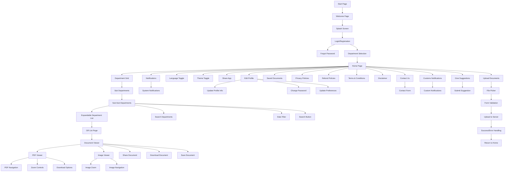

# 🌲 Forest Department GR & Updates App

**Client:** Rahul Sapkal, RFO  
**Prepared By:** Akshay – Alpha Developer Team  
**Date:** 30 Nov 2024  
**Last Updated:** September 2025

---

## 📱 Project Overview

This Flutter-based mobile application enables Forest Department staff and stakeholders to access Government Regulations (GRs), law updates, and official communications in various formats (PDF, text, images). The app is designed for cross-platform use (Android/iOS/Web/Desktop), with a focus on speed, clarity, and accessibility. The project now includes a complete PHP backend API for user management and document handling.

---

## 🎯 Key Features

### ✅ **Implemented Features**
- **User Authentication:** Secure login and registration with form validation and PHP backend integration
- **Password Management:** Forgot password functionality with email-based reset and secure password updates
- **Department Selection:** Users can select their department and district for personalized content
- **Home Feed:** Grid-based navigation to categorized content (PDFs, images, text)
- **Content Viewer:** In-app PDF and image viewing, with options to share and download documents
- **Document Management:** Upload, update, delete, and manage documents with proper access controls
- **Document Upload System:** Complete form-based document submission with file picker, validation, and server upload
- **Expandable Department List:** On the sub-sub-departments page, each department row can be expanded to show all departments with their respective logos
- **Profile Management:** Edit and update user profile information
- **Policy & Legal Info:** In-app access to privacy policy, terms, refund, and disclaimer pages
- **Contact & Support:** Contact us page and suggestion submission system
- **Document Sharing:** Share documents with other users and track shared documents
- **Saved Documents:** Bookmark and save frequently accessed documents
- **Notifications System:** Custom notifications and system notifications for updates
- **Modern UI:** Clean, responsive design with custom themes and scalable typography
- **Offline Assets:** Bundled images, PDFs, and data for offline access
- **PHP Backend API:** Complete backend system for user management, document handling, and data persistence
- **Admin Panel:** Administrative interface for user and content management

### 🚧 **In Progress**
- **Advanced Notifications:** Enhanced push notification system with user preferences
- **Multi-language Support:** Language selection for broader accessibility
- **Document Versioning:** Track document changes and maintain version history

### 📋 **Planned Features**
- Advanced search and filtering capabilities
- User activity tracking and analytics
- Bulk document operations
- Real-time collaboration features
- Advanced security features (2FA, biometric authentication)

---

## 🧭 App Flow



---

## 🎨 Theme and Design Language

| Element     | Color Code         |
|-------------|-------------------|
| Primary     | Forest Green `#228B22` |
| Secondary   | Dark Grey `#333333`    |
| Background  | White `#FFFFFF`        |

- **Typography:** Clean, high-contrast fonts (OpenSans) for readability in outdoor environments
- **Icons:** Material icons for navigation and actions
- **Responsive Design:** Uses `flutter_screenutil` for adaptive sizing across different screen sizes

---

## 🔧 Tech Stack

| Layer           | Technology                        | Status |
|-----------------|-----------------------------------|---------|
| Frontend        | Flutter + Dart                    | ✅ Complete |
| State Management| Provider                          | ✅ Complete |
| PDF Viewer      | `syncfusion_flutter_pdfviewer`, `pdfx` | ✅ Complete |
| Image Viewer    | `photo_view`                      | ✅ Complete |
| Sharing         | `share_plus`                      | ✅ Complete |
| HTTP/Assets     | `dio`, `http`, `path_provider`    | ✅ Complete |
| UI Utilities    | `flutter_screenutil`, `google_nav_bar` | ✅ Complete |
| File Handling   | `file_picker`, `shared_preferences` | ✅ Complete |
| Backend         | PHP + MySQL                       | ✅ Complete |
| Database        | MySQL                             | ✅ Complete |
| API Framework   | Custom PHP API                    | ✅ Complete |

---

## 📁 Project Structure

```
App/
├── lib/
│   ├── main.dart                    # Main app entry point
│   ├── pages/                       # App screens and pages
│   │   ├── start_page.dart          # App initialization
│   │   ├── welcome_page.dart        # Welcome screen
│   │   ├── login_Page.dart          # User authentication
│   │   ├── registration.dart        # User registration
│   │   ├── forgot_password.dart     # Password recovery
│   │   ├── deptselection_page.dart  # Department selection
│   │   ├── home_page.dart           # Main dashboard
│   │   ├── gr_list.dart             # GR List page
│   │   ├── sub_departments.dart     # Sub-departments
│   │   ├── sub_sub_departments.dart # Expandable department list
│   │   ├── pdf_viewer.dart          # PDF document viewer
│   │   ├── img_viewer.dart          # Image viewer
│   │   ├── edit_profile.dart        # Profile management
│   │   ├── contact_us.dart          # Contact information
│   │   ├── give_sugg.dart           # Suggestion submission
│   │   ├── saved_docs.dart          # Saved documents
│   │   ├── share_doc.dart           # Document upload and sharing
│   │   ├── notification_page.dart   # Notifications
│   │   ├── customs_notifictions.dart # Custom notifications
│   │   ├── terms_and_conditions.dart # Terms page
│   │   ├── privacy_policies.dart    # Privacy policy
│   │   ├── refund_policies.dart     # Refund policy
│   │   └── disclaimer_policies.dart # Disclaimer
│   ├── reusable_or_snipit_widgets/  # Shared components
│   │   ├── api_service.dart         # HTTP client and API calls
│   │   ├── api_list.dart            # API endpoint definitions
│   │   ├── app_config.dart          # App configuration
│   │   ├── user_storage.dart        # Local data persistence
│   │   ├── hamburger_menu.dart      # Navigation menu
│   │   ├── home_page_band.dart      # Home page header
│   │   └── theme_provider.dart      # Theme management
│   └── splash_screen.dart           # App launch screen
├── api/                             # PHP Backend API
│   ├── login.php                    # User authentication
│   ├── register.php                 # User registration
│   ├── password_reset.php           # Password reset
│   ├── password_update.php          # Password update
│   ├── users.php                    # User management
│   ├── admin_users.php              # Admin user management
│   ├── admin_login.php              # Admin authentication
│   ├── documents.php                # Document handling
│   ├── document_upload.php          # Document upload
│   ├── document_details.php         # Document information
│   ├── update_document.php          # Document updates
│   ├── delete_document.php          # Document deletion
│   ├── download_document.php        # Document download
│   ├── document_access_logs.php     # Access tracking
│   ├── share_document.php           # Document sharing
│   ├── shared_document.php          # Shared documents
│   ├── departments.php              # Department data
│   ├── districts.php                # District data
│   ├── categories.php               # Category management
│   ├── add_category.php             # Add categories
│   ├── update_category.php          # Update categories
│   ├── delete_category.php          # Delete categories
│   ├── notifications.php            # Notification system
│   ├── suggestions.php              # User suggestions
│   ├── update_user_status.php       # User status management
│   ├── connect.inc.php              # Database connection
│   ├── core.inc.php                 # Core functions
│   ├── security_fixes.php           # Security enhancements
│   └── uploads/                     # Document storage
├── assets/                          # App resources
│   ├── data/                        # Local JSON data
│   ├── fonts/                       # Custom fonts
│   ├── images/                      # App images and icons
│   └── pdf_img_text/                # Sample documents
├── android/                         # Android-specific code
├── ios/                            # iOS-specific code
├── web/                            # Web platform support
├── windows/                        # Windows desktop support
├── linux/                          # Linux desktop support
├── macos/                          # macOS desktop support
├── pubspec.yaml                    # Flutter dependencies
├── maha_gr.sql                     # Database schema
├── API_DOCUMENTATION.md            # API documentation
├── API_QUICK_REFERENCE.md          # Quick API reference
├── API_SETUP_GUIDE.md              # API setup guide
├── api_improvements.md             # API enhancement recommendations
├── UPLOAD_FUNCTIONALITY.md         # Upload feature docs
├── NOTIFICATIONS_API_INTEGRATION.md # Notifications docs
└── README.md                       # Project documentation
```

---

## 🚀 Getting Started

### Prerequisites

- [Flutter SDK](https://flutter.dev/docs/get-started/install) (>=3.7.2)
- [PHP](https://php.net/) (>=7.4) for backend API
- [MySQL](https://mysql.com/) (>=5.7) for database
- Android Studio or Xcode for device emulation
- Internet connection for package installation

### Installation

#### 1. **Flutter App Setup**
```sh
git clone <repo-url>
cd forrest_department_gr_and_updatees_app/App
flutter pub get
```

#### 2. **Backend API Setup**
```sh
# Copy api/ folder to your web server (e.g., XAMPP, WAMP, or live server)
# Import maha_gr.sql to your MySQL database
# Update api/app_config.php with your database credentials
```

#### 3. **Configuration**
- Update `lib/reusable_or_snipit_widgets/app_config.dart` with your API base URL
- Ensure database connection in `api/connect.inc.php`
- Set proper file permissions for uploads directory

#### 4. **Run the app**
```sh
flutter run
```

### Assets

- All images, PDFs, and data are located in the `assets/` directory and registered in `pubspec.yaml`
- Sample documents are included in `assets/pdf_img_text/` for testing

---

## 📡 Data Sources & APIs

### ✅ **Implemented Backend APIs**

#### Authentication & User Management
- **POST /api/login.php** - User authentication with email/password
- **POST /api/register.php** - User registration
- **POST /api/password_reset.php** - Password reset functionality
- **POST /api/password_update.php** - Password update
- **GET /api/users.php** - User listing and management
- **POST /api/update_user_status.php** - User status management
- **POST /api/admin_login.php** - Admin authentication
- **GET /api/admin_users.php** - Admin user management

#### Department & Category Management
- **GET /api/departments.php** - List all departments
- **GET /api/districts.php** - List all districts
- **GET /api/categories.php** - List categories (with optional department filter)
- **POST /api/add_category.php** - Add new category
- **POST /api/update_category.php** - Update existing category
- **POST /api/delete_category.php** - Delete category

#### Document Management
- **GET /api/documents.php** - List documents with filters
- **POST /api/document_upload.php** - Upload new documents
- **POST /api/update_document.php** - Update document details
- **POST /api/delete_document.php** - Delete documents
- **POST /api/download_document.php** - Download documents
- **GET /api/document_details.php** - Get document information
- **GET /api/document_access_logs.php** - Track document access

#### Document Sharing & Collaboration
- **POST /api/share_document.php** - Share documents with users
- **GET /api/shared_document.php** - Get shared documents

#### Notifications & Feedback
- **GET /api/notifications.php** - User notifications
- **POST /api/suggestions.php** - Submit suggestions/feedback

### 📊 **Database Schema**
The app uses a MySQL database with the following main tables:
- `users` - User accounts and profiles
- `departments` - Department information
- `districts` - District data
- `categories` - Document categories
- `documents` - Document metadata and files
- `document_shares` - Document sharing records
- `notifications` - User notifications
- `suggestions` - User feedback
- `document_access_logs` - Document access tracking

### 🔒 **Security Features**
- Password hashing using MD5 (⚠️ **Security Alert:** Upgrade to bcrypt recommended - see `api_improvements.md`)
- Prepared statements to prevent SQL injection
- Input validation and sanitization
- User status management (Active/Inactive)
- Document access logging
- Admin role-based access control

### 🚨 **Security Recommendations**
Based on the comprehensive API improvement analysis (see `api_improvements.md`):
- **High Priority:** Upgrade password hashing from MD5 to bcrypt/Argon2
- **High Priority:** Implement CSRF protection and rate limiting
- **Medium Priority:** Add comprehensive input validation and sanitization
- **Medium Priority:** Implement API response standardization
- **Low Priority:** Add JWT token-based authentication

---

## 🐛 Recent Bug Fixes & Improvements

### **September 2025 - Comprehensive API Enhancement Plan**
- **API Improvements Document:** Created detailed roadmap for API security, performance, and UX improvements
- **Security Focus:** Identified need for password hashing upgrade from MD5 to bcrypt/Argon2
- **Performance Optimization:** Database indexing, caching implementation, and pagination recommendations
- **Enhanced Documentation:** Comprehensive API improvement guidelines and best practices

### **January 2025 - Login Authentication Fix**
- **Issue:** Wrong passwords were incorrectly navigating to home page
- **Root Cause:** PHP API was returning `status = 'false'` for successful logins
- **Fix:** Corrected PHP login logic and improved Flutter error handling
- **Files Modified:** `api/login.php`, `lib/pages/login_Page.dart`

### **API Service Improvements**
- Enhanced error handling with Dio HTTP client
- Better network connectivity testing
- Improved response parsing and validation
- Added comprehensive logging for debugging

### **Code Quality Updates**
- Cleaned up API response handling
- Added proper error messages for different failure scenarios
- Improved user feedback and validation

### **New Features Added**
- Document sharing system
- Saved documents functionality
- Contact us and suggestions system
- Enhanced notification system
- Admin panel for user management

---

## 🛠️ Development Notes

- **State Management:** Uses Provider for scalable state handling
- **Responsive UI:** Uses `flutter_screenutil` for adaptive sizing
- **PDF/Image Viewing:** Supports both asset and network-based documents
- **Offline Support:** Bundled assets for basic offline access
- **Backend Integration:** Complete PHP API with MySQL database
- **Cross-Platform:** Supports Android, iOS, Web, Windows, Linux, and macOS
- **File Handling:** Supports document upload, download, and sharing
- **Security:** Implements proper authentication and authorization

---

## 📄 Legal & Policies

- **Privacy Policy:** See `PrivacyPolicies` page in-app
- **Terms & Conditions:** See `TermsAndConditions` page in-app
- **Refund Policy:** See `RefundPolicies` page in-app
- **Disclaimer:** See `DisclaimerPolicies` page in-app

---

## 🧪 Testing

### **Tested Scenarios**
- ✅ User registration and login
- ✅ Password reset and update
- ✅ Department and district selection
- ✅ Document viewing (PDF, images)
- ✅ Document upload and management
- ✅ Document sharing and collaboration
- ✅ Profile management
- ✅ Contact and suggestions
- ✅ Error handling for invalid credentials
- ✅ Cross-platform compatibility
- ✅ Admin panel functionality

### **Known Issues**
- None currently identified

---

## 🚀 Deployment

### **Mobile Apps**
- Android: Build APK with `flutter build apk`
- iOS: Build with Xcode for App Store distribution

### **Web App**
- Build with `flutter build web`
- Deploy to any web hosting service

### **Desktop Apps**
- Windows: `flutter build windows`
- Linux: `flutter build linux`
- macOS: `flutter build macos`

---

## 🤝 Contributing

Pull requests are welcome! For major changes, please open an issue first to discuss what you would like to change.

### **Development Guidelines**
- Follow Flutter best practices
- Use meaningful commit messages
- Test on multiple platforms before submitting
- Update documentation for new features

---

## 📧 Contact

For support or business inquiries, contact the Alpha Developer Team.

---

## 📝 License

This project is proprietary and intended for use by the Forest Department and authorized personnel only.

---

## 📈 Project Status

**Overall Progress: 95% Complete**

- ✅ **Core App Features:** 100%
- ✅ **Backend API:** 100%
- ✅ **Database:** 100%
- ✅ **Authentication:** 100%
- ✅ **Document Management:** 100%
- ✅ **User Management:** 100%
- ✅ **Document Sharing:** 100%
- ✅ **Contact & Support:** 100%
- ✅ **API Documentation:** 100%
- ✅ **API Enhancement Plan:** 100%
- 🚧 **Notifications:** 85%
- 🚧 **Multi-language:** 40%
- 📋 **Advanced Features:** 25%

**Next Milestone:** Implement API security improvements (password hashing upgrade), complete notification system, and enhance multi-language support

---

## 🏠 **Home Page Navigation Structure**

The Home Page serves as the central hub with **4 main navigation areas**:

### **1. Department Grid (Main Content)**
- **3x3 Grid Layout** displaying department logos and names
- **Navigation Flow:** Home → Department Grid → Sub Departments → Sub-Sub Departments → Expandable List → GR List → Document Viewer
- **Features:** Search functionality, date filtering, expandable department rows

### **2. Home Page Band (Top Bar)**
- **Notifications:** Access to system notifications
- **Language Toggle:** Switch between English and Marathi
- **Theme Toggle:** Change app appearance
- **Share App:** Share the application

### **3. Hamburger Menu (Left Drawer)**
- **Profile Management:** Edit Profile, Saved Documents
- **Legal Pages:** Privacy Policies, Refund Policies, Terms & Conditions, Disclaimer
- **Support:** Contact Us

### **4. App Bar More Menu (Top Right)**
- **Customs Notifications:** Custom notification system
- **Give Suggestions:** Submit feedback and suggestions
- **Upload Documents:** Document upload functionality

### **Key Navigation Patterns:**
- **Department Flow:** Grid → List → Expandable → Documents → Viewers
- **Settings Flow:** Profile → Preferences → Policies → Support
- **Content Flow:** Upload → Validate → Process → Store → Share
- **Search Flow:** Input → Filter → Results → Navigation

---

## 📚 Additional Documentation

- **API Documentation:** See `API_DOCUMENTATION.md` for detailed API reference
- **Quick Reference:** See `API_QUICK_REFERENCE.md` for common API calls
- **Setup Guide:** See `API_SETUP_GUIDE.md` for backend setup
- **API Improvements:** See `api_improvements.md` for enhancement recommendations
- **Upload Features:** See `UPLOAD_FUNCTIONALITY.md` for document upload details
- **Notifications:** See `NOTIFICATIONS_API_INTEGRATION.md` for notification system
